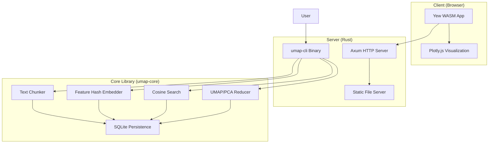
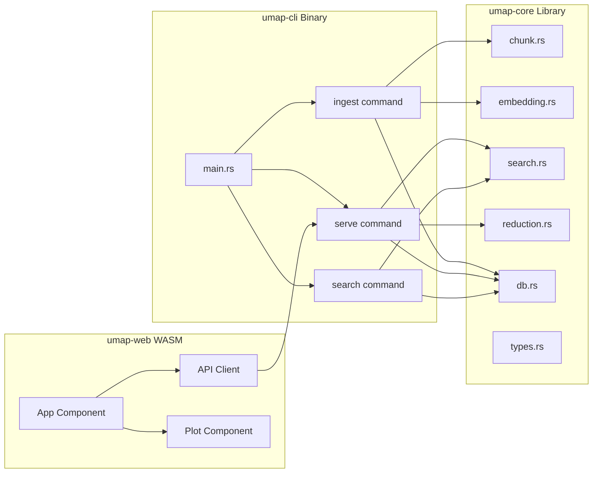
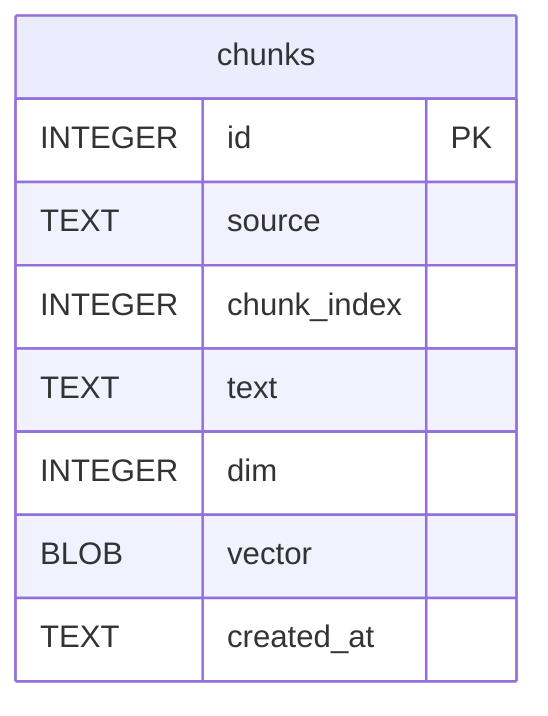
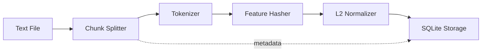
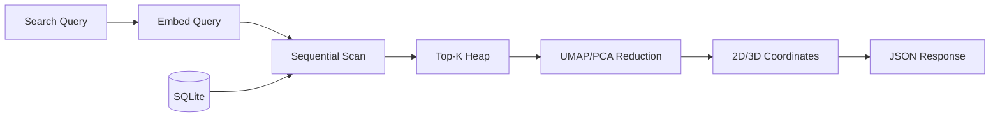
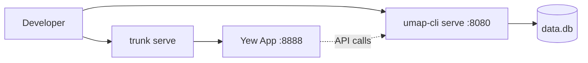
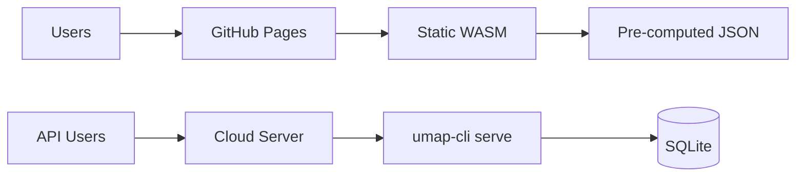

# Architecture

This page provides a detailed overview of the UMAP Text Visualizer system architecture.

## System Overview

UMAP Text Visualizer is a Rust-based system for text embedding, vector search, and interactive visualization using dimensionality reduction techniques.

### High-Level Architecture



### Component Architecture



## Workspace Structure

The project uses a Cargo workspace with three crates:

### 1. umap-core (Library)

Core functionality shared by CLI and future integrations.

**Modules:**
- `chunk.rs` - Text chunking with configurable overlap
- `embedding.rs` - Feature hashing embedder (no external models)
- `db.rs` - SQLite persistence layer
- `search.rs` - Cosine similarity search
- `reduction.rs` - Dimensionality reduction (UMAP/PCA)
- `types.rs` - Shared data structures

See [[umap-core]] for detailed documentation.

### 2. umap-cli (Binary)

CLI tool and HTTP server.

**Commands:**
- `ingest` - Chunk and embed text files into SQLite
- `serve` - Run Axum HTTP server with API and static files
- `search` - Perform CLI search queries

**API Endpoints:**
- `GET /api/search` - Search with dimensionality reduction
- `POST /api/ingest_text` - Runtime text ingestion

See [[umap-cli]] for detailed documentation.

### 3. umap-web (WASM)

Yew-based frontend for interactive visualization.

**Features:**
- Search input and query submission
- 2D/3D visualization toggle
- UMAP parameter controls
- Interactive Plotly scatter plots
- Result list with snippets and scores

See [[umap-web]] for detailed documentation.

## Data Architecture

### SQLite Schema



**Table: chunks**

| Column | Type | Description |
|--------|------|-------------|
| id | INTEGER PRIMARY KEY | Auto-incrementing chunk ID |
| source | TEXT | Source filename or identifier |
| chunk_index | INTEGER | Position in source file |
| text | TEXT | Chunk content |
| dim | INTEGER | Embedding dimension (e.g., 512) |
| vector | BLOB | Serialized f32 array (little-endian) |
| created_at | TEXT | ISO 8601 timestamp |

### Vector Storage

Embedding vectors are stored as BLOBs containing contiguous little-endian f32 values:

```
[f32; dim] -> BLOB of (dim * 4) bytes
```

All vectors are L2-normalized for cosine similarity computation.

## Processing Pipeline

### Ingestion Pipeline



**Steps:**
1. Read text file
2. Split into chunks (paragraphs or sentence windows)
3. Tokenize each chunk (lowercase, filter)
4. Apply feature hashing to fixed dimension
5. L2-normalize vectors
6. Store in SQLite with metadata

### Search Pipeline



**Steps:**
1. Embed query text using same feature hasher
2. Sequential scan of all vectors in database
3. Compute cosine similarity for each
4. Keep top-K results in max-heap
5. Apply dimensionality reduction (UMAP or PCA)
6. Return coordinates with metadata

## Technology Choices

### Why Rust?

- **Type safety** - Compile-time guarantees for correctness
- **Performance** - Zero-cost abstractions, no garbage collection
- **WASM support** - Full-stack Rust via Yew and wasm32 target
- **Ecosystem** - Rich crate ecosystem (Axum, SQLite, ndarray)

### Why Feature Hashing?

Feature hashing provides:
- **No external dependencies** - No API calls or model files
- **Deterministic** - Same text always produces same embedding
- **Fast** - Simple hash computation
- **Portable** - Works anywhere Rust runs

Trade-offs:
- Lower quality than transformer models
- No semantic understanding
- Hash collisions possible

### Why SQLite?

- **Embedded** - No separate database server
- **Portable** - Single file database
- **ACID** - Reliable transactions
- **Sufficient** - Good for moderate-scale demos

For production scale, consider:
- SQLite vector extensions (sqlite-vss)
- Dedicated vector databases (Qdrant, Milvus)
- Approximate nearest neighbor indices

### Why UMAP/PCA?

- **Visualization** - Reduce high-dimensional embeddings to 2D/3D
- **Pattern discovery** - Reveal clusters and relationships
- **Interactive exploration** - Users can see search results spatially

**PCA** (Principal Component Analysis):
- Linear method
- Fast and deterministic
- Always available (via linfa-reduction)

**UMAP** (Uniform Manifold Approximation and Projection):
- Non-linear method
- Preserves local structure better
- Custom implementation in reduction.rs

## Scalability Considerations

### Current Limitations

- **Sequential scan** - O(n) search time
- **In-memory reduction** - Loads all top-K vectors into memory
- **Single-threaded** - No parallelization

### Future Improvements

1. **Indexing** - Add HNSW or IVF index for approximate search
2. **Batching** - Process multiple queries in parallel
3. **Caching** - Cache reduced coordinates for repeated queries
4. **Sampling** - Sample subset for large-scale reduction
5. **Streaming** - Stream results for large K values

## Deployment Architectures

### Development Mode



### Production Mode



See [[Deployment]] for detailed deployment instructions.

## Related Pages

- [[Data Flow]] - Sequence diagrams and detailed flows
- [[umap-core]] - Core library implementation details
- [[umap-cli]] - CLI and server implementation details
- [[umap-web]] - Frontend implementation details
- [Design Documentation](../../blob/main/documentation/design.md) - Design decisions

## External Resources

- [UMAP Paper](https://arxiv.org/abs/1802.03426) - Original UMAP algorithm
- [Feature Hashing](https://en.wikipedia.org/wiki/Feature_hashing) - Hashing trick explanation
- [Yew Framework](https://yew.rs/) - Rust WASM framework
- [Axum](https://docs.rs/axum/) - Rust web framework
