# Data Flow

This page details the data flow patterns and sequences for key operations in the UMAP Text Visualizer.

## Overview

The system has three primary workflows:
1. **Ingestion** - Processing text files into embeddings
2. **Search** - Finding similar chunks and visualizing results
3. **Runtime Ingestion** - Adding text via API

## Ingestion Flow

### CLI Ingest Command

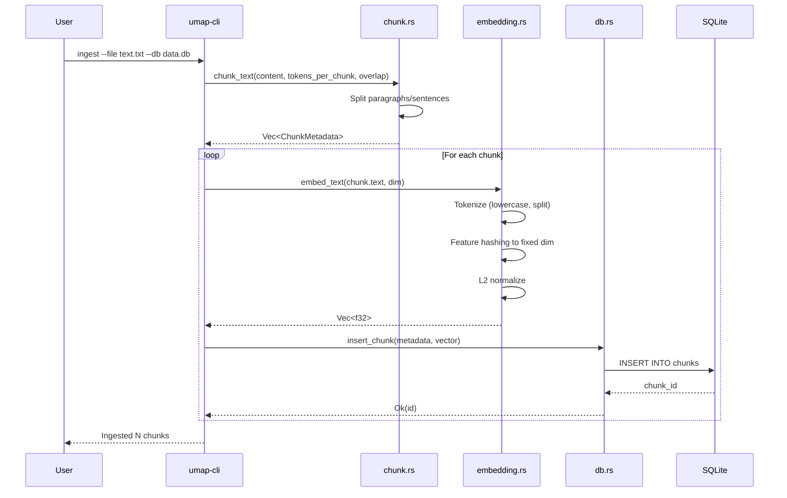

**Key Steps:**

1. User invokes CLI with file path and database
2. Text file is read into memory
3. Chunker splits text into overlapping segments
4. Each chunk is:
   - Tokenized (lowercase, filter short words)
   - Hashed to fixed-dimension vector
   - L2-normalized
   - Stored in SQLite with metadata
5. Progress is reported to user

## Search Flow

### Search Query Processing

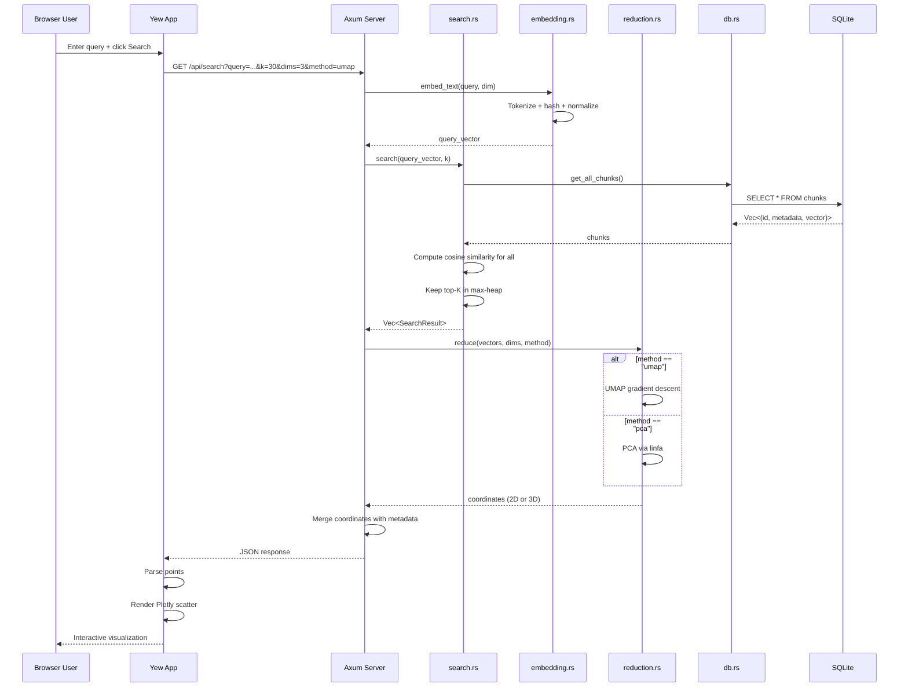

**Key Steps:**

1. User enters query in web UI
2. Web UI sends HTTP GET to `/api/search`
3. Server embeds query using same hasher
4. Sequential scan computes cosine similarity for all chunks
5. Top-K results kept in max-heap
6. Results passed to dimensionality reducer
7. UMAP or PCA produces 2D/3D coordinates
8. Coordinates merged with metadata (text, score, source)
9. JSON response sent to client
10. Client renders interactive Plotly scatter plot

### Cosine Similarity Calculation

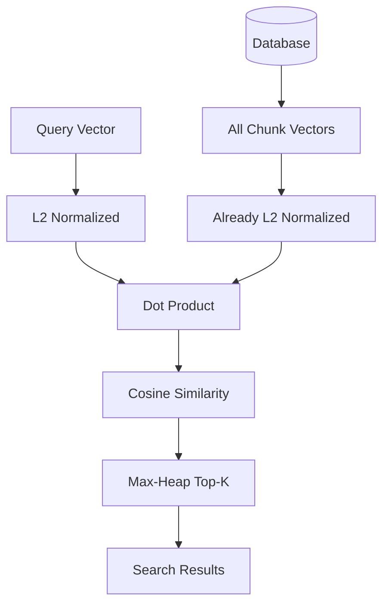

Since all vectors are L2-normalized, cosine similarity reduces to a simple dot product:

```
cosine_sim(a, b) = dot(a, b)  // when ||a|| = ||b|| = 1
```

## Runtime Ingestion Flow

### POST API Ingestion

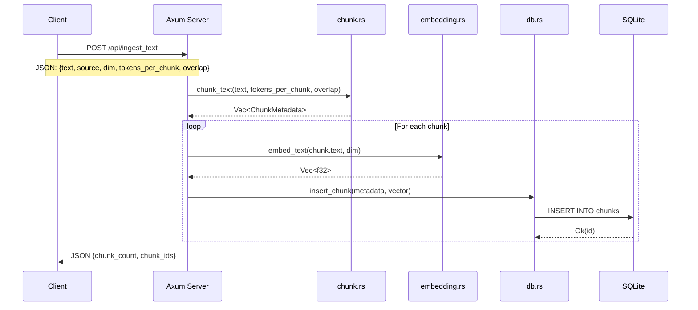

**Key Steps:**

1. Client sends POST with JSON payload
2. Server chunks the text
3. Each chunk is embedded and stored
4. Server responds with chunk count and IDs

## Dimensionality Reduction Flow

### UMAP Algorithm

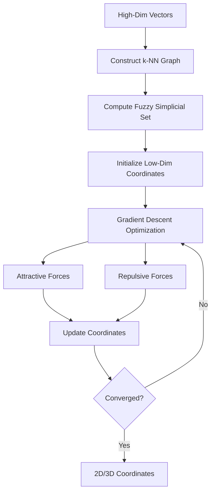

**UMAP Parameters:**

- `n_neighbors` - Size of local neighborhood (default 15)
- `min_dist` - Minimum distance between points (default 0.1)
- `n_epochs` - Optimization iterations (default 200)
- `learning_rate` - Step size for gradient descent (default 1.0)

See [[Architecture#UMAP Parameters]] for full parameter list.

### PCA Algorithm

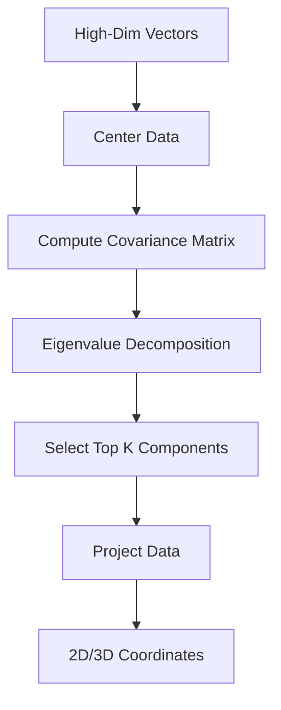

PCA is deterministic and fast, but captures only linear relationships.

## Frontend Update Flow

### Plotly Rendering

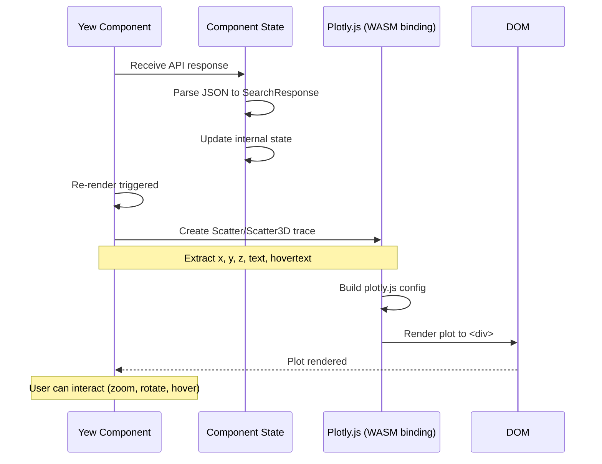

**Data Transformation:**

```
API Response          Plotly Format
-------------         -------------
{                     {
  points: [             x: [1.2, 3.4, ...],
    {x: 1.2,            y: [5.6, 7.8, ...],
     y: 5.6,            z: [9.0, 1.1, ...],  // if 3D
     z: 9.0,            text: ["chunk1", "chunk2", ...],
     text: "...",       hovertext: ["score: 0.95", ...]
     score: 0.95}     }
  ]
}
```

## Error Handling Flow

### Search Error Handling

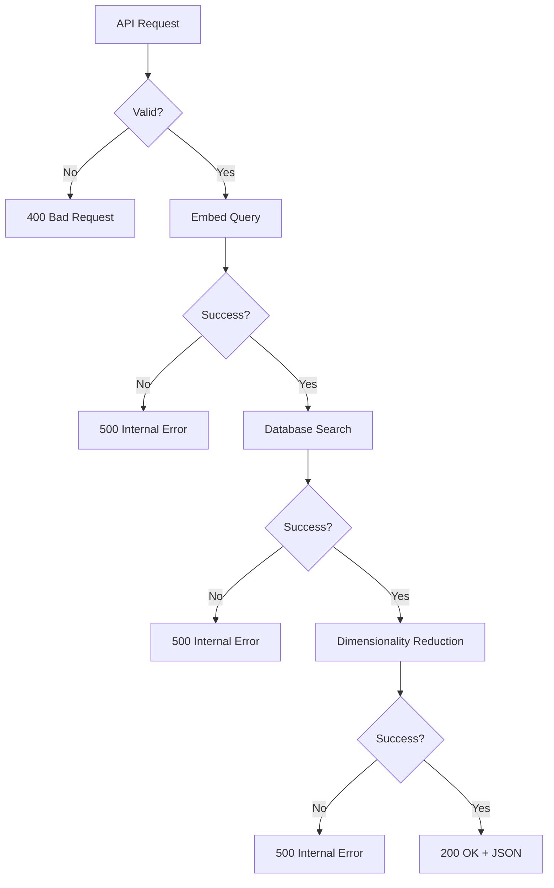

**Error Categories:**

- **400 Bad Request** - Invalid parameters (missing query, invalid dims)
- **500 Internal Server Error** - Database errors, reduction failures
- **503 Service Unavailable** - Database connection failures

## Performance Considerations

### Sequential Scan Performance

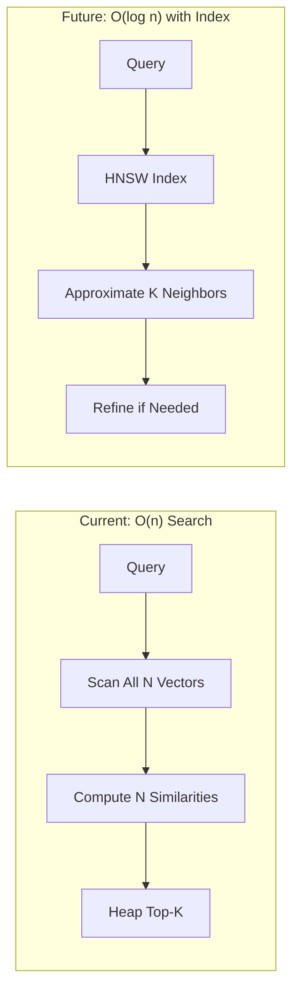

**Trade-offs:**

Current (sequential scan):
- Simple implementation
- Exact results
- Works for small datasets (<100k chunks)
- No index maintenance

Future (approximate search):
- Complex implementation
- Approximate results (tunable)
- Scales to millions of chunks
- Index build/update overhead

## Data Persistence

### Write Path

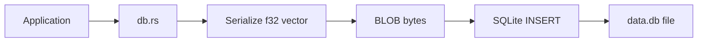

### Read Path

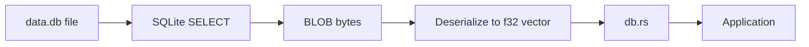

**Vector Serialization:**

```rust
// Write
let bytes: Vec<u8> = vector.iter()
    .flat_map(|f| f.to_le_bytes())
    .collect();

// Read
let floats: Vec<f32> = bytes.chunks_exact(4)
    .map(|chunk| f32::from_le_bytes([chunk[0], chunk[1], chunk[2], chunk[3]]))
    .collect();
```

All vectors use little-endian encoding for portability.

## Related Pages

- [[Architecture]] - System architecture overview
- [[umap-core]] - Core library implementation
- [[umap-cli]] - CLI and API implementation
- [[umap-web]] - Frontend implementation

## External Resources

- [Axum Request Lifecycle](https://docs.rs/axum/latest/axum/#routing) - Axum routing and handlers
- [SQLite BLOB Performance](https://www.sqlite.org/intern-v-extern-blob.html) - BLOB storage recommendations
- [UMAP Algorithm](https://arxiv.org/abs/1802.03426) - Original UMAP paper with algorithm details
