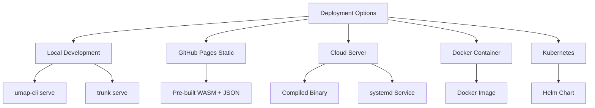
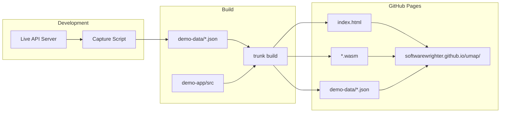
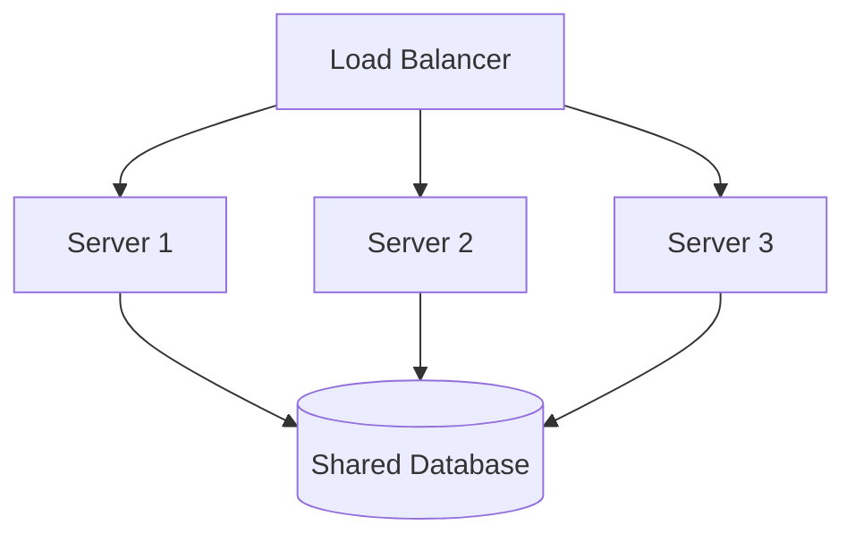

# Deployment

This page covers deployment strategies for the UMAP Text Visualizer in various environments.

## Deployment Options



## Local Development

### Prerequisites

```bash
# Install Rust toolchain
curl --proto '=https' --tlsv1.2 -sSf https://sh.rustup.rs | sh

# Add WASM target
rustup target add wasm32-unknown-unknown

# Install Trunk
cargo install trunk
```

### Setup Database

```bash
# Create database and ingest sample data
cargo build --release
./target/release/umap-cli ingest \
  --db data.db \
  --file sample-data.txt \
  --dim 512 \
  --tokens-per-chunk 1000 \
  --overlap 300
```

### Run Backend

```bash
# Build backend
cargo build --release -p umap-cli

# Run server
./target/release/umap-cli serve \
  --db data.db \
  --static-dir crates/umap-web/dist \
  --addr 127.0.0.1:8080
```

### Run Frontend (Development)

```bash
# Terminal 1: Serve API
./target/release/umap-cli serve --db data.db

# Terminal 2: Development server with hot reload
cd crates/umap-web
trunk serve --port 8888 --proxy-backend=http://localhost:8080/api
```

**Access:**
- Frontend: http://localhost:8888
- API: http://localhost:8080/api/search

## GitHub Pages (Static Demo)

### Overview

Deploy a static demo without a backend using pre-computed JSON data.



### Build Process

#### 1. Setup Demo Data

```bash
# Run setup script (creates demo-app directory)
bash scripts/setup-demo.sh

# Start API server
./target/release/umap-cli serve --db data.db --addr 127.0.0.1:8080

# Capture demo data
bash scripts/create-demo-data.sh
```

**create-demo-data.sh** queries the API and saves responses:

```bash
#!/bin/bash
mkdir -p demo-app/assets/demo-data

queries=("machine learning" "neural networks" "data science")

for query in "${queries[@]}"; do
    curl "http://localhost:8080/api/search?query=${query}&k=50&dims=3&method=umap" \
      > "demo-app/assets/demo-data/$(echo $query | tr ' ' '-').json"
done
```

#### 2. Build Demo

```bash
# Build static site
cd demo-app
trunk build --release --public-url /umap/

# Output written to docs/ (configured in Trunk.toml)
```

**Trunk.toml:**

```toml
[build]
target = "index.html"
dist = "../docs"
public_url = "/umap/"
```

#### 3. Deploy to GitHub Pages

```bash
# Ensure .nojekyll exists (bypass Jekyll processing)
touch docs/.nojekyll

# Commit built files
git add docs/
git commit -m "Update GitHub Pages demo"

# Push to GitHub
git push origin main
```

#### 4. Configure GitHub Pages

1. Go to repository Settings
2. Navigate to Pages
3. Set Source: "Deploy from a branch"
4. Select branch: `main`
5. Select folder: `/docs`
6. Save

**Access:** https://softwarewrighter.github.io/umap/

### Demo Limitations

- No real-time search (only pre-computed queries)
- Cannot ingest new data
- Fixed UMAP parameters (pre-computed)
- Limited query set

### Updating Demo

```bash
# Rebuild with new data
bash scripts/create-demo-data.sh  # Capture new API responses
cd demo-app
trunk build --release
git add ../docs/
git commit -m "Update demo data"
git push origin main
```

## Cloud Server Deployment

### DigitalOcean / AWS / GCP

#### 1. Build Release Binary

```bash
# On development machine or CI
cargo build --release --target x86_64-unknown-linux-musl

# Build frontend
cd crates/umap-web
trunk build --release --dist dist
```

#### 2. Transfer to Server

```bash
# Copy binary
scp target/x86_64-unknown-linux-musl/release/umap-cli user@server:/opt/umap/

# Copy frontend
rsync -av crates/umap-web/dist/ user@server:/opt/umap/static/

# Copy or create database
scp data.db user@server:/opt/umap/data/
```

#### 3. Create systemd Service

```bash
# /etc/systemd/system/umap.service
[Unit]
Description=UMAP Text Visualizer
After=network.target

[Service]
Type=simple
User=umap
WorkingDirectory=/opt/umap
ExecStart=/opt/umap/umap-cli serve \
  --db /opt/umap/data/data.db \
  --static-dir /opt/umap/static \
  --addr 0.0.0.0:8080
Restart=on-failure
RestartSec=10

[Install]
WantedBy=multi-user.target
```

#### 4. Start Service

```bash
# Create user
sudo useradd -r -s /bin/false umap
sudo chown -R umap:umap /opt/umap

# Enable and start service
sudo systemctl daemon-reload
sudo systemctl enable umap
sudo systemctl start umap
sudo systemctl status umap
```

#### 5. Configure Nginx Reverse Proxy

```nginx
server {
    listen 80;
    server_name umap.example.com;

    location / {
        proxy_pass http://127.0.0.1:8080;
        proxy_set_header Host $host;
        proxy_set_header X-Real-IP $remote_addr;
        proxy_set_header X-Forwarded-For $proxy_add_x_forwarded_for;
    }

    # Optional: Enable gzip
    gzip on;
    gzip_types text/plain text/css application/json application/javascript application/wasm;
}
```

#### 6. SSL with Let's Encrypt

```bash
sudo certbot --nginx -d umap.example.com
```

## Docker Deployment

### Dockerfile

```dockerfile
# Multi-stage build
FROM rust:1.75 as builder

# Install wasm tools
RUN rustup target add wasm32-unknown-unknown
RUN cargo install trunk

WORKDIR /app
COPY . .

# Build backend
RUN cargo build --release -p umap-cli

# Build frontend
WORKDIR /app/crates/umap-web
RUN trunk build --release --dist dist

# Runtime image
FROM debian:bookworm-slim

# Install runtime dependencies
RUN apt-get update && \
    apt-get install -y ca-certificates && \
    rm -rf /var/lib/apt/lists/*

# Copy binaries and static files
COPY --from=builder /app/target/release/umap-cli /usr/local/bin/
COPY --from=builder /app/crates/umap-web/dist /app/static

# Create data directory
RUN mkdir -p /app/data

EXPOSE 8080

CMD ["umap-cli", "serve", \
     "--db", "/app/data/data.db", \
     "--static-dir", "/app/static", \
     "--addr", "0.0.0.0:8080"]
```

### Build and Run

```bash
# Build image
docker build -t umap-visualizer:latest .

# Run container
docker run -d \
  --name umap \
  -p 8080:8080 \
  -v $(pwd)/data:/app/data \
  umap-visualizer:latest
```

### Docker Compose

```yaml
version: '3.8'

services:
  umap:
    build: .
    ports:
      - "8080:8080"
    volumes:
      - ./data:/app/data
    restart: unless-stopped
    environment:
      RUST_LOG: info
    healthcheck:
      test: ["CMD", "curl", "-f", "http://localhost:8080/"]
      interval: 30s
      timeout: 10s
      retries: 3
```

```bash
# Start
docker-compose up -d

# View logs
docker-compose logs -f

# Stop
docker-compose down
```

## Kubernetes Deployment

### Deployment Manifest

```yaml
apiVersion: apps/v1
kind: Deployment
metadata:
  name: umap-visualizer
  labels:
    app: umap
spec:
  replicas: 3
  selector:
    matchLabels:
      app: umap
  template:
    metadata:
      labels:
        app: umap
    spec:
      containers:
      - name: umap
        image: umap-visualizer:latest
        ports:
        - containerPort: 8080
        env:
        - name: RUST_LOG
          value: "info"
        volumeMounts:
        - name: data
          mountPath: /app/data
        resources:
          requests:
            memory: "256Mi"
            cpu: "250m"
          limits:
            memory: "512Mi"
            cpu: "500m"
        livenessProbe:
          httpGet:
            path: /
            port: 8080
          initialDelaySeconds: 10
          periodSeconds: 30
        readinessProbe:
          httpGet:
            path: /
            port: 8080
          initialDelaySeconds: 5
          periodSeconds: 10
      volumes:
      - name: data
        persistentVolumeClaim:
          claimName: umap-data-pvc
```

### Service Manifest

```yaml
apiVersion: v1
kind: Service
metadata:
  name: umap-service
spec:
  selector:
    app: umap
  ports:
  - protocol: TCP
    port: 80
    targetPort: 8080
  type: LoadBalancer
```

### PersistentVolumeClaim

```yaml
apiVersion: v1
kind: PersistentVolumeClaim
metadata:
  name: umap-data-pvc
spec:
  accessModes:
  - ReadWriteOnce
  resources:
    requests:
      storage: 10Gi
```

### Deploy

```bash
# Apply manifests
kubectl apply -f k8s/pvc.yaml
kubectl apply -f k8s/deployment.yaml
kubectl apply -f k8s/service.yaml

# Check status
kubectl get pods
kubectl get svc

# View logs
kubectl logs -f deployment/umap-visualizer

# Scale
kubectl scale deployment/umap-visualizer --replicas=5
```

## Environment Variables

| Variable | Default | Description |
|----------|---------|-------------|
| RUST_LOG | info | Logging level (trace, debug, info, warn, error) |
| DATABASE_PATH | - | Override --db flag |
| STATIC_DIR | ./static | Override --static-dir flag |
| BIND_ADDR | 127.0.0.1:8080 | Override --addr flag |

**Example:**

```bash
RUST_LOG=debug DATABASE_PATH=/data/prod.db ./umap-cli serve
```

## Monitoring

### Health Checks

```bash
# Simple health check
curl http://localhost:8080/

# API health check
curl http://localhost:8080/api/search?query=test&k=1
```

### Prometheus Metrics

Future enhancement: Add `/metrics` endpoint.

```rust
// Metrics to expose
- http_requests_total
- http_request_duration_seconds
- search_queries_total
- database_query_duration_seconds
```

### Logging

**Structured logging with tracing:**

```bash
# Set log level
RUST_LOG=debug ./umap-cli serve --db data.db

# Log to file
RUST_LOG=info ./umap-cli serve --db data.db 2>&1 | tee app.log

# JSON logging (future)
RUST_LOG_FORMAT=json ./umap-cli serve --db data.db
```

## Performance Tuning

### Database Optimization

```sql
-- Add indices for common queries
CREATE INDEX idx_dim ON chunks(dim);
CREATE INDEX idx_source ON chunks(source);

-- Analyze tables
ANALYZE chunks;

-- Vacuum database
VACUUM;
```

### Connection Pooling

Future: Use connection pool for concurrent requests.

```rust
use r2d2::Pool;
use r2d2_sqlite::SqliteConnectionManager;

let manager = SqliteConnectionManager::file("data.db");
let pool = Pool::new(manager)?;
```

### Caching

**Future: Add Redis cache for search results:**

```
Query hash -> Cached response (TTL: 1 hour)
```

### Horizontal Scaling



**Considerations:**

- Read-heavy workload: SQLite scales well
- Write-heavy workload: Consider PostgreSQL with pgvector
- Shared storage: NFS or cloud object storage

## Security

### Firewall Rules

```bash
# Allow HTTP/HTTPS only
sudo ufw allow 80/tcp
sudo ufw allow 443/tcp
sudo ufw enable
```

### Rate Limiting

**Using Nginx:**

```nginx
limit_req_zone $binary_remote_addr zone=api:10m rate=10r/s;

server {
    location /api/ {
        limit_req zone=api burst=20 nodelay;
        proxy_pass http://127.0.0.1:8080;
    }
}
```

### CORS Configuration

**Add to server:**

```rust
use tower_http::cors::CorsLayer;

let app = app.layer(
    CorsLayer::new()
        .allow_origin("https://example.com".parse::<HeaderValue>()?)
        .allow_methods([Method::GET, Method::POST])
);
```

## Backup and Recovery

### Database Backup

```bash
# Backup
sqlite3 data.db ".backup data-backup-$(date +%Y%m%d).db"

# Or using cp (while server is running - SQLite handles locks)
cp data.db data-backup.db

# Restore
cp data-backup.db data.db
```

### Automated Backups

```bash
# crontab entry
0 2 * * * /opt/umap/backup.sh

# backup.sh
#!/bin/bash
BACKUP_DIR="/opt/umap/backups"
DATE=$(date +%Y%m%d)
sqlite3 /opt/umap/data/data.db ".backup ${BACKUP_DIR}/data-${DATE}.db"
# Keep last 7 days
find ${BACKUP_DIR} -name "data-*.db" -mtime +7 -delete
```

## Troubleshooting

### Common Issues

**Port already in use:**

```bash
# Find process using port
lsof -i :8080
# Or
sudo netstat -tulpn | grep 8080

# Kill process
kill -9 <PID>
```

**Database locked:**

```bash
# Check for stale locks
fuser data.db

# Force unlock (stop server first)
sqlite3 data.db "PRAGMA busy_timeout = 5000;"
```

**WASM not loading:**

Check browser console for MIME type errors. Ensure server sends correct headers:

```
Content-Type: application/wasm
```

**Out of memory:**

Reduce batch size or increase system memory:

```bash
# Check memory usage
free -h

# Adjust search limit
curl "http://localhost:8080/api/search?query=test&k=10"  # Reduce k
```

## Related Pages

- [[Architecture]] - System architecture
- [[umap-cli]] - CLI and server details
- [[umap-web]] - Frontend details
- [GitHub Pages Demo](https://softwarewrighter.github.io/umap/) - Live demo

## External Resources

- [Rust Deployment Guide](https://doc.rust-lang.org/cargo/guide/continuous-integration.html)
- [Docker Best Practices](https://docs.docker.com/develop/dev-best-practices/)
- [Kubernetes Documentation](https://kubernetes.io/docs/)
- [Let's Encrypt](https://letsencrypt.org/) - Free SSL certificates
- [Nginx Documentation](https://nginx.org/en/docs/)
