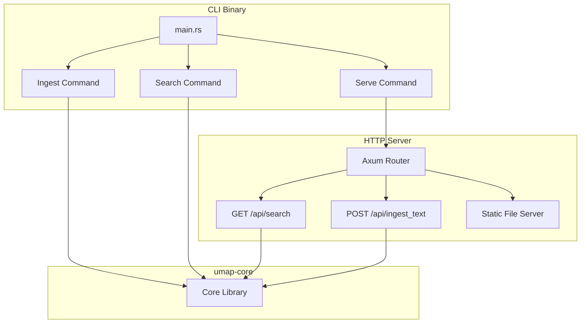
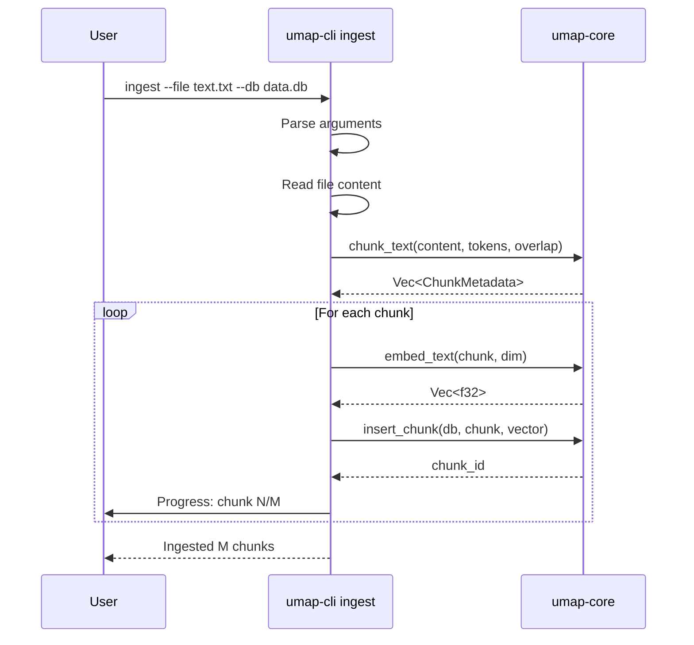
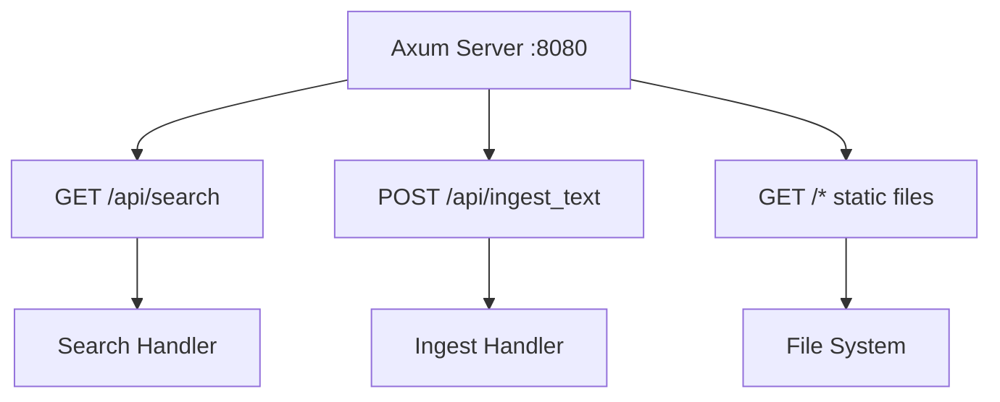
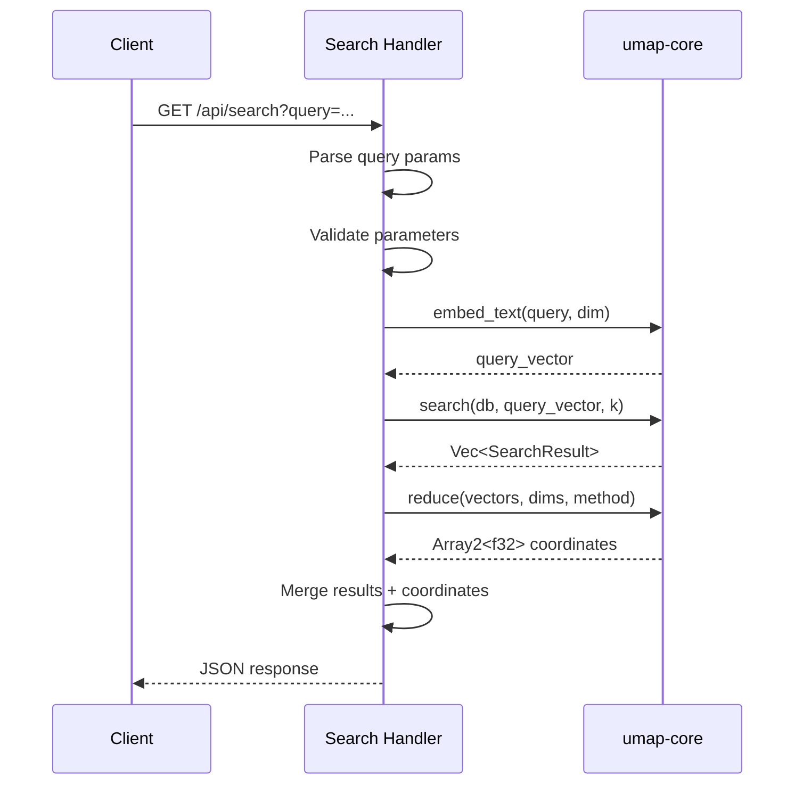
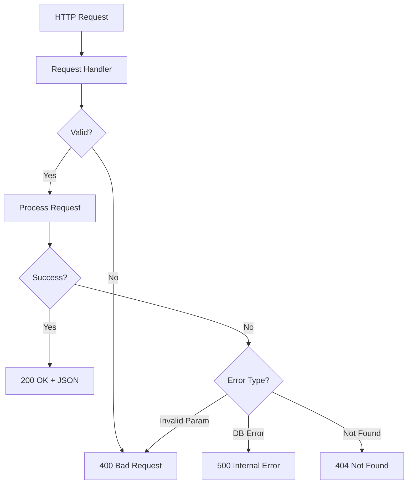
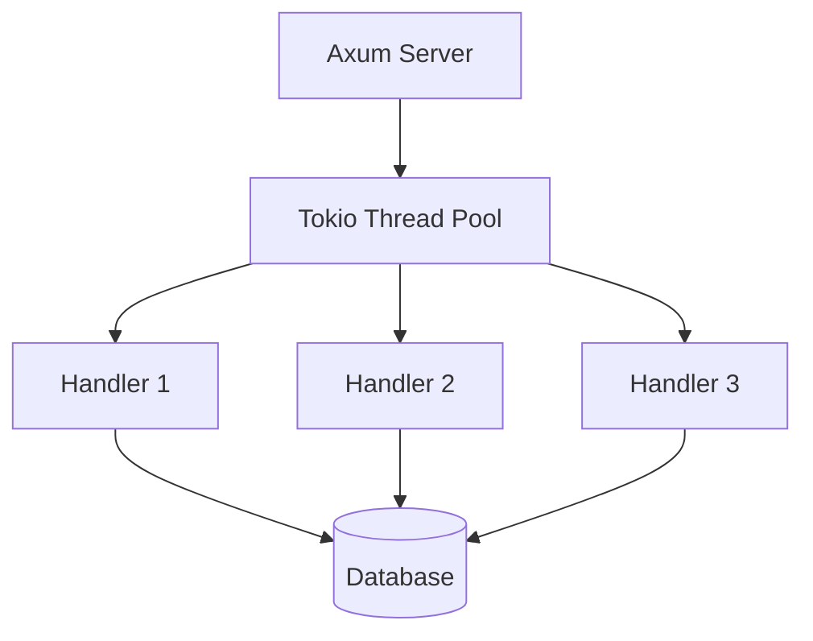

# umap-cli

The `umap-cli` crate provides the command-line interface and HTTP server for the UMAP Text Visualizer.

## Overview

**Location:** `crates/umap-cli/`

**Purpose:**
- CLI tool for text ingestion and search
- Axum-based HTTP server
- JSON API for web frontend
- Static file serving

## Architecture



## CLI Commands

### ingest - Import Text Files

**Purpose:** Chunk, embed, and store text files in SQLite database.

**Usage:**

```bash
umap-cli ingest [OPTIONS] --db <DATABASE> --file <FILE>

Options:
  --db <DATABASE>              Path to SQLite database
  --file <FILE>                Path to text file to ingest
  --dim <DIM>                  Embedding dimension [default: 512]
  --tokens-per-chunk <COUNT>   Tokens per chunk [default: 1000]
  --overlap <OVERLAP>          Chunk overlap in tokens [default: 300]
  -h, --help                   Print help
```

**Example:**

```bash
# Basic usage
./target/release/umap-cli ingest \
  --db data.db \
  --file article.txt

# Custom parameters
./target/release/umap-cli ingest \
  --db data.db \
  --file large-book.txt \
  --dim 1024 \
  --tokens-per-chunk 2000 \
  --overlap 500
```

**Flow:**



### serve - Run HTTP Server

**Purpose:** Start Axum HTTP server with API and static files.

**Usage:**

```bash
umap-cli serve [OPTIONS] --db <DATABASE>

Options:
  --db <DATABASE>              Path to SQLite database
  --static-dir <DIR>           Directory with static files [default: ./static]
  --addr <ADDRESS>             Server address [default: 127.0.0.1:8080]
  -h, --help                   Print help
```

**Example:**

```bash
# Basic usage
./target/release/umap-cli serve \
  --db data.db \
  --static-dir crates/umap-web/dist

# Custom address
./target/release/umap-cli serve \
  --db data.db \
  --static-dir crates/umap-web/dist \
  --addr 0.0.0.0:3000
```

**Server Routes:**



### search - CLI Search

**Purpose:** Quick command-line search without starting server.

**Usage:**

```bash
umap-cli search [OPTIONS] --db <DATABASE> --query <QUERY>

Options:
  --db <DATABASE>    Path to SQLite database
  --query <QUERY>    Search query text
  --k <K>            Number of results [default: 20]
  -h, --help         Print help
```

**Example:**

```bash
# Basic search
./target/release/umap-cli search \
  --db data.db \
  --query "machine learning algorithms"

# More results
./target/release/umap-cli search \
  --db data.db \
  --query "neural networks" \
  --k 50
```

**Output:**

```
Top 20 results for query: "machine learning algorithms"

1. Score: 0.9234
   Source: ml-textbook.txt (chunk 42)
   Text: Machine learning algorithms can be broadly categorized...

2. Score: 0.8891
   Source: ml-textbook.txt (chunk 15)
   Text: Supervised learning algorithms require labeled training data...

[... more results ...]
```

## HTTP API

### GET /api/search

**Purpose:** Search with dimensionality reduction for visualization.

**Query Parameters:**

| Parameter | Type | Required | Default | Description |
|-----------|------|----------|---------|-------------|
| query | string | Yes | - | Search query text |
| k | integer | No | 30 | Number of results |
| dims | integer | No | 2 | Output dimensions (2 or 3) |
| method | string | No | umap | Reduction method (umap or pca) |
| n_neighbors | integer | No | 15 | UMAP: neighborhood size |
| min_dist | float | No | 0.1 | UMAP: minimum distance |
| spread | float | No | 1.0 | UMAP: spread scale |
| n_epochs | integer | No | 200 | UMAP: training iterations |
| learning_rate | float | No | 1.0 | UMAP: gradient descent rate |
| negative_sample_rate | integer | No | 5 | UMAP: negatives per positive |
| random_state | integer | No | 42 | UMAP: random seed |

**Request Example:**

```bash
curl "http://localhost:8080/api/search?query=neural+networks&k=30&dims=3&method=umap"
```

**Response Format:**

```json
{
  "query": "neural networks",
  "k": 30,
  "dims": 3,
  "method": "umap",
  "points": [
    {
      "id": 42,
      "source": "ml-textbook.txt",
      "chunk_index": 15,
      "text": "Neural networks are computing systems...",
      "score": 0.9234,
      "x": 1.234,
      "y": -0.567,
      "z": 2.890
    },
    ...
  ]
}
```

**Flow Diagram:**



### POST /api/ingest_text

**Purpose:** Add text to database at runtime.

**Request Body:**

```json
{
  "text": "Text content to ingest...",
  "source": "user-upload.txt",
  "dim": 512,
  "tokens_per_chunk": 1000,
  "overlap": 300
}
```

**Response:**

```json
{
  "success": true,
  "chunk_count": 5,
  "chunk_ids": [101, 102, 103, 104, 105]
}
```

**Example:**

```bash
curl -X POST http://localhost:8080/api/ingest_text \
  -H "Content-Type: application/json" \
  -d '{
    "text": "Long article text...",
    "source": "api-upload.txt",
    "dim": 512,
    "tokens_per_chunk": 1000,
    "overlap": 300
  }'
```

### Static File Serving

**Purpose:** Serve Yew WASM frontend.

**Routes:**

```
GET /              -> index.html
GET /index.html    -> index.html
GET /*.js          -> JavaScript files
GET /*.wasm        -> WASM binaries
GET /*.css         -> Stylesheets
```

**Example:**

```
http://localhost:8080/              # Main app
http://localhost:8080/index.html    # Explicit index
http://localhost:8080/app.js        # WASM glue code
http://localhost:8080/app_bg.wasm   # WASM binary
```

## Implementation Details

### Server State

```rust
#[derive(Clone)]
struct ServerState {
    db: Arc<Database>,
    config: Arc<ServerConfig>,
}

struct ServerConfig {
    default_k: usize,
    default_dims: usize,
    default_method: String,
}
```

The database connection is wrapped in `Arc` for thread-safe sharing across handlers.

### Error Handling



**Error Response Format:**

```json
{
  "error": "Invalid dimension: must be 2 or 3",
  "code": "INVALID_PARAMETER"
}
```

### Logging

The server uses `tracing` for structured logging:

```rust
use tracing::{info, warn, error};

info!("Server listening on {}", addr);
warn!("Large query: k={}, may be slow", k);
error!("Database error: {}", err);
```

**Log Levels:**

- `TRACE` - Detailed debugging
- `DEBUG` - Development info
- `INFO` - Normal operations
- `WARN` - Potential issues
- `ERROR` - Failures

**Set Log Level:**

```bash
RUST_LOG=debug ./target/release/umap-cli serve --db data.db
```

## Performance Considerations

### Concurrent Requests

Axum uses Tokio for async request handling:



SQLite read operations can run concurrently. Write operations are serialized.

### Request Timeouts

```rust
// Example timeout configuration
let app = app.layer(
    TimeoutLayer::new(Duration::from_secs(30))
);
```

Long-running searches (large k, complex UMAP) may timeout.

### Caching Strategies

Future optimization: Cache reduced coordinates for common queries.

```
Query Hash -> Cached Response
"neural networks" + k=30 + dims=2 -> {...}
```

## Deployment

### Development

```bash
# Terminal 1: Build and run server
cargo build
./target/debug/umap-cli serve --db data.db --static-dir crates/umap-web/dist

# Terminal 2: Watch and rebuild frontend
cd crates/umap-web
trunk watch
```

### Production

```bash
# Build release binaries
cargo build --release

# Build frontend
cd crates/umap-web
trunk build --release --dist dist

# Run server
./target/release/umap-cli serve \
  --db /data/production.db \
  --static-dir /app/static \
  --addr 0.0.0.0:8080
```

### Docker Deployment

```dockerfile
FROM rust:1.75 as builder
WORKDIR /app
COPY . .
RUN cargo build --release

FROM debian:bookworm-slim
COPY --from=builder /app/target/release/umap-cli /usr/local/bin/
COPY --from=builder /app/crates/umap-web/dist /app/static
EXPOSE 8080
CMD ["umap-cli", "serve", "--db", "/data/data.db", "--static-dir", "/app/static", "--addr", "0.0.0.0:8080"]
```

## Testing

### Unit Tests

```bash
cargo test -p umap-cli
```

### Integration Tests

```bash
# Start test server
./target/debug/umap-cli serve --db test.db &
SERVER_PID=$!

# Run API tests
curl http://localhost:8080/api/search?query=test
curl -X POST http://localhost:8080/api/ingest_text -d '{...}'

# Cleanup
kill $SERVER_PID
```

### Load Testing

```bash
# Using Apache Bench
ab -n 1000 -c 10 "http://localhost:8080/api/search?query=test&k=20"

# Using wrk
wrk -t4 -c100 -d30s "http://localhost:8080/api/search?query=test"
```

## Related Pages

- [[Architecture]] - Overall system design
- [[Data Flow]] - Request/response flows
- [[umap-core]] - Core library used by CLI
- [[umap-web]] - Frontend that uses this API
- [[Deployment]] - Deployment guide
- [Source Code](../../tree/main/crates/umap-cli) - Browse source

## External Resources

- [Axum Documentation](https://docs.rs/axum/) - Web framework
- [Tokio Documentation](https://tokio.rs/) - Async runtime
- [clap Documentation](https://docs.rs/clap/) - CLI argument parsing
- [tracing Documentation](https://docs.rs/tracing/) - Structured logging
