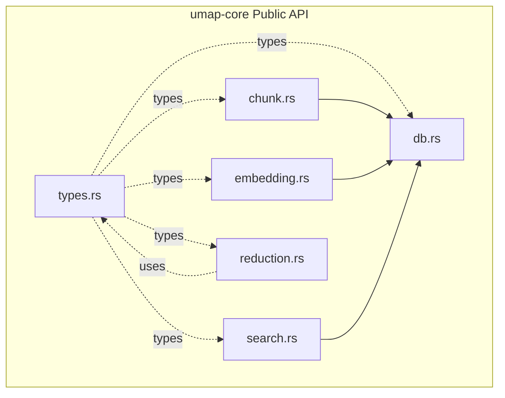
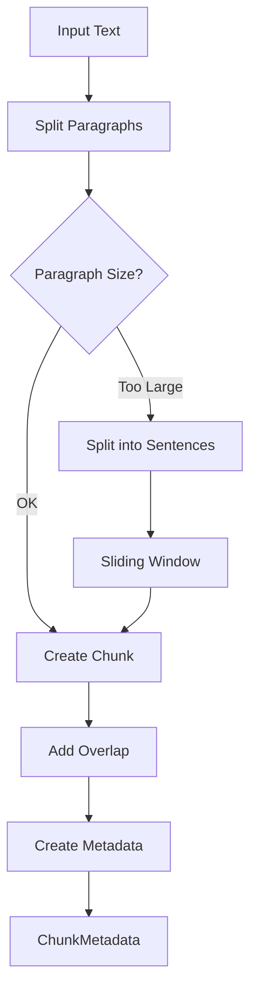
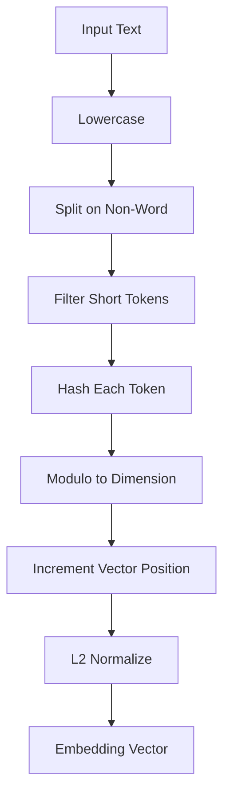
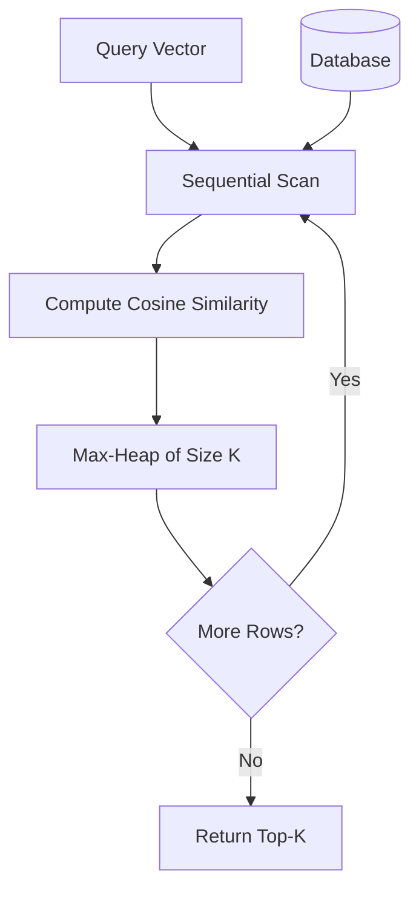
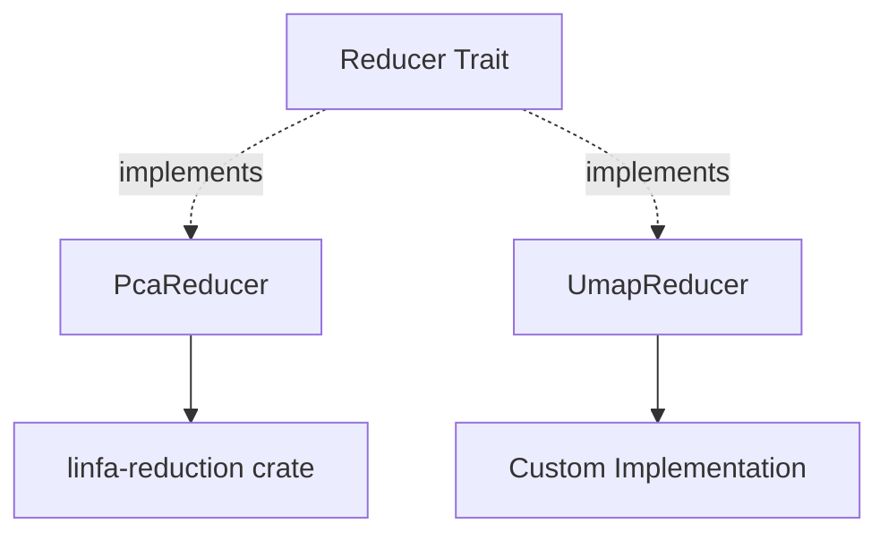
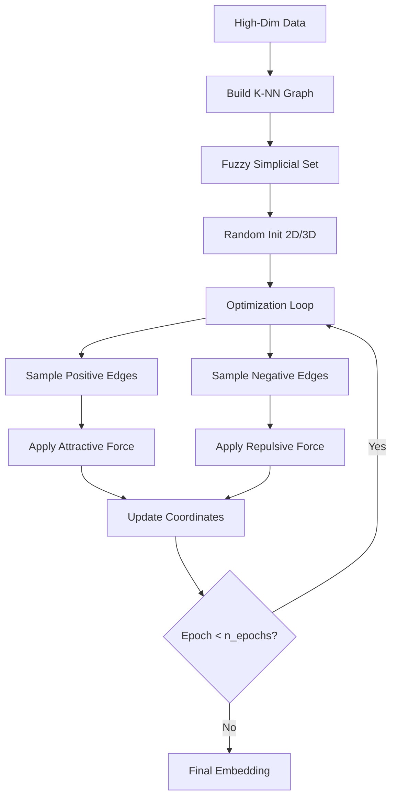
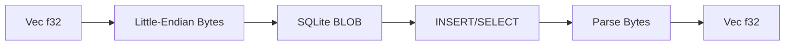
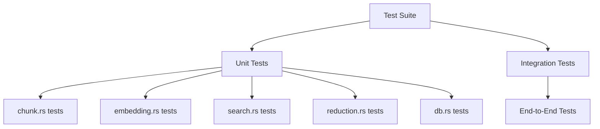

# umap-core

The `umap-core` crate is the foundational library providing all core functionality for text processing, embedding, search, and dimensionality reduction.

## Overview

**Location:** `crates/umap-core/`

**Purpose:** Self-contained library for:
- Text chunking with configurable overlap
- Feature hashing embeddings (no external models)
- SQLite persistence
- Cosine similarity search
- UMAP and PCA dimensionality reduction

## Module Architecture



## Module Details

### chunk.rs - Text Chunking

**Purpose:** Split text into overlapping chunks for embedding.

**Key Functions:**

```rust
pub fn chunk_text(
    text: &str,
    tokens_per_chunk: usize,
    overlap: usize
) -> Vec<ChunkMetadata>
```

**Algorithm:**



**Features:**
- Paragraph-based splitting (preferred)
- Sentence-window fallback for large paragraphs
- Configurable token count per chunk
- Configurable overlap between chunks
- Metadata tracking (source, index)

**Example:**

```rust
let chunks = chunk_text("Long text...", 1000, 300);
// chunks[0]: tokens 0-1000
// chunks[1]: tokens 700-1700 (300 token overlap)
```

### embedding.rs - Feature Hashing Embedder

**Purpose:** Convert text to fixed-dimension vectors using feature hashing.

**Key Functions:**

```rust
pub fn embed_text(text: &str, dim: usize) -> Vec<f32>
```

**Algorithm:**



**Features:**
- No external models required
- Deterministic (same input = same output)
- Configurable dimension (default 512)
- L2-normalized for cosine similarity
- Lightweight and fast

**Hashing Details:**

```rust
// Simplified example
for token in tokens {
    let hash = hash_function(token);
    let index = hash % dim;
    vector[index] += 1.0;
}
// L2 normalize
let magnitude = vector.iter().map(|x| x * x).sum::<f32>().sqrt();
vector.iter_mut().for_each(|x| *x /= magnitude);
```

**Trade-offs:**
- ✅ Self-contained, portable
- ✅ Fast computation
- ✅ Deterministic
- ❌ No semantic understanding
- ❌ Hash collisions possible
- ❌ Lower quality than transformer models

### search.rs - Cosine Similarity Search

**Purpose:** Find most similar chunks to a query vector.

**Key Functions:**

```rust
pub fn search(
    db: &Database,
    query_vector: &[f32],
    k: usize
) -> Result<Vec<SearchResult>>
```

**Algorithm:**



**Features:**
- Sequential scan (simple, exact)
- Cosine similarity metric
- Max-heap for top-K tracking
- Returns results with scores and metadata

**Complexity:**
- Time: O(n) where n = total chunks
- Space: O(k) for heap

**Cosine Similarity:**

Since all vectors are L2-normalized:

```rust
fn cosine_similarity(a: &[f32], b: &[f32]) -> f32 {
    a.iter().zip(b).map(|(x, y)| x * y).sum()
}
```

**Future Optimizations:**
- HNSW index for approximate search
- SQLite vector extensions (sqlite-vss)
- GPU acceleration for large batches

### reduction.rs - Dimensionality Reduction

**Purpose:** Reduce high-dimensional embeddings to 2D/3D for visualization.

**Key Trait:**

```rust
pub trait Reducer {
    fn reduce(&self, data: &Array2<f32>, target_dims: usize) -> Result<Array2<f32>>;
}
```

**Implementations:**



#### PCA Reducer

**Algorithm:** Principal Component Analysis

**Features:**
- Linear method
- Deterministic results
- Fast computation
- Always available

**Steps:**
1. Center data (subtract mean)
2. Compute covariance matrix
3. Eigenvalue decomposition
4. Project to top K eigenvectors

#### UMAP Reducer

**Algorithm:** Uniform Manifold Approximation and Projection

**Features:**
- Non-linear method
- Preserves local structure
- Custom gradient descent implementation
- Configurable parameters

**Parameters:**

| Parameter | Default | Description |
|-----------|---------|-------------|
| n_neighbors | 15 | Neighborhood size for graph |
| min_dist | 0.1 | Minimum distance in embedding |
| spread | 1.0 | Scale of embedded points |
| n_epochs | 200 | Training iterations |
| learning_rate | 1.0 | Gradient descent step size |
| negative_sample_rate | 5 | Negatives per positive sample |
| random_state | 42 | Random seed for reproducibility |

**UMAP Algorithm Flow:**



### db.rs - SQLite Persistence

**Purpose:** Store and retrieve chunks with embeddings.

**Key Functions:**

```rust
pub fn create_database(path: &str) -> Result<Database>
pub fn insert_chunk(db: &Database, chunk: &ChunkData) -> Result<i64>
pub fn get_all_chunks(db: &Database) -> Result<Vec<ChunkData>>
pub fn get_chunk_by_id(db: &Database, id: i64) -> Result<Option<ChunkData>>
```

**Schema:**

```sql
CREATE TABLE chunks (
    id INTEGER PRIMARY KEY AUTOINCREMENT,
    source TEXT NOT NULL,
    chunk_index INTEGER NOT NULL,
    text TEXT NOT NULL,
    dim INTEGER NOT NULL,
    vector BLOB NOT NULL,
    created_at TEXT NOT NULL
);
```

**Vector Serialization:**



**Features:**
- ACID transactions
- Single-file database
- Portable across platforms
- Efficient BLOB storage

**Indexing:**

Current: No indices (small datasets)

Future considerations:
```sql
CREATE INDEX idx_source ON chunks(source);
CREATE INDEX idx_created_at ON chunks(created_at);
```

### types.rs - Shared Data Types

**Purpose:** Common types used across modules.

**Key Types:**

```rust
pub struct ChunkMetadata {
    pub source: String,
    pub chunk_index: usize,
    pub text: String,
}

pub struct ChunkData {
    pub id: Option<i64>,
    pub source: String,
    pub chunk_index: usize,
    pub text: String,
    pub dim: usize,
    pub vector: Vec<f32>,
    pub created_at: String,
}

pub struct SearchResult {
    pub id: i64,
    pub source: String,
    pub chunk_index: usize,
    pub text: String,
    pub score: f32,
}

pub struct Point2D {
    pub x: f32,
    pub y: f32,
}

pub struct Point3D {
    pub x: f32,
    pub y: f32,
    pub z: f32,
}
```

## Dependencies

Key external crates:

- `rusqlite` - SQLite database interface
- `ndarray` - N-dimensional arrays for numerical computation
- `linfa-reduction` - PCA implementation
- `serde` - Serialization/deserialization
- `rand` - Random number generation (for UMAP)

## Testing

**Test Coverage:**



**Run Tests:**

```bash
cargo test -p umap-core
cargo test -p umap-core --lib        # Only unit tests
cargo test -p umap-core --test '*'   # Only integration tests
```

## Usage Examples

### Basic Pipeline

```rust
use umap_core::*;

// Create database
let db = create_database("data.db")?;

// Chunk text
let chunks = chunk_text("Long article...", 1000, 300);

// Embed and store
for chunk in chunks {
    let vector = embed_text(&chunk.text, 512);
    insert_chunk(&db, &ChunkData {
        source: "article.txt".to_string(),
        chunk_index: chunk.chunk_index,
        text: chunk.text,
        dim: 512,
        vector,
        created_at: chrono::Utc::now().to_rfc3339(),
        id: None,
    })?;
}

// Search
let query = embed_text("search query", 512);
let results = search(&db, &query, 20)?;

// Reduce for visualization
let vectors: Vec<Vec<f32>> = results.iter()
    .map(|r| r.vector.clone())
    .collect();
let reducer = UmapReducer::default();
let coords = reducer.reduce(&vectors, 2)?;
```

## Performance Characteristics

| Operation | Complexity | Notes |
|-----------|------------|-------|
| Chunking | O(n) | n = text length |
| Embedding | O(m) | m = token count |
| Insert | O(1) | SQLite write |
| Search | O(k*d) | k = chunks, d = dimension |
| PCA | O(n²*d) | n = samples, d = dimension |
| UMAP | O(n*e*d) | e = epochs |

## Related Pages

- [[Architecture]] - Overall system architecture
- [[Data Flow]] - Detailed flow diagrams
- [[umap-cli]] - CLI using this library
- [Source Code](../../tree/main/crates/umap-core) - Browse source

## External Resources

- [Feature Hashing Paper](https://arxiv.org/abs/0902.2206) - Weinberger et al.
- [UMAP Documentation](https://umap-learn.readthedocs.io/) - Python implementation
- [rusqlite Documentation](https://docs.rs/rusqlite/) - SQLite Rust bindings
- [ndarray Documentation](https://docs.rs/ndarray/) - N-dimensional arrays
