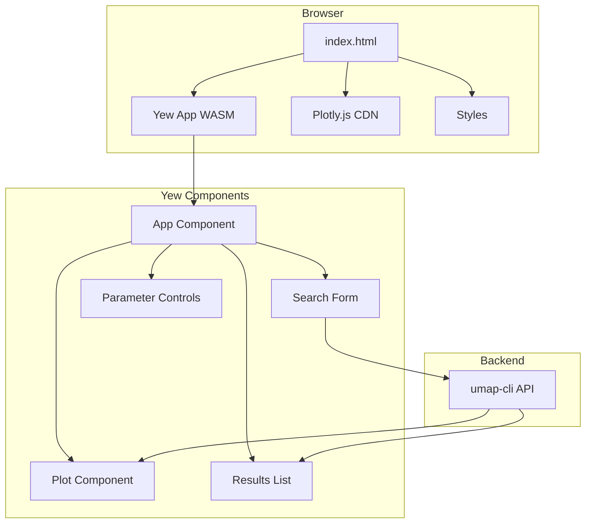
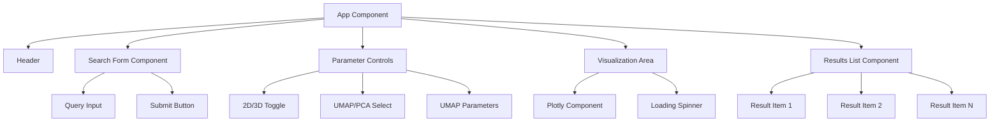
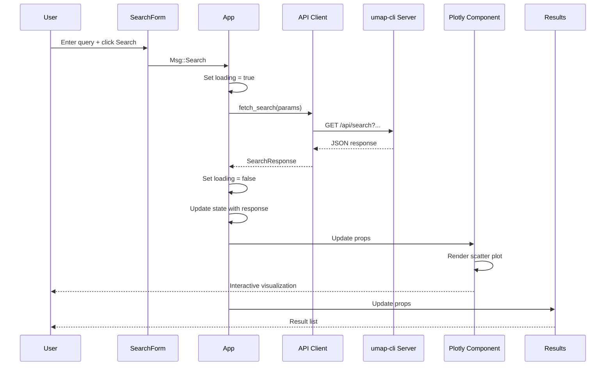
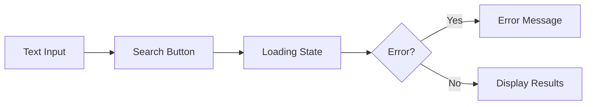
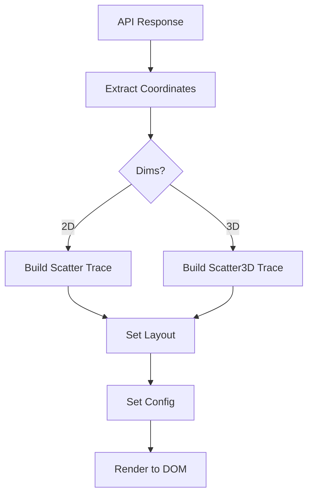
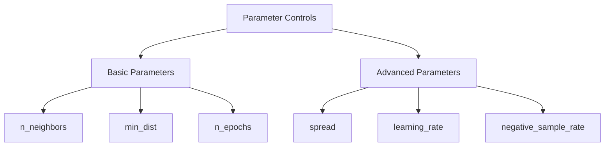
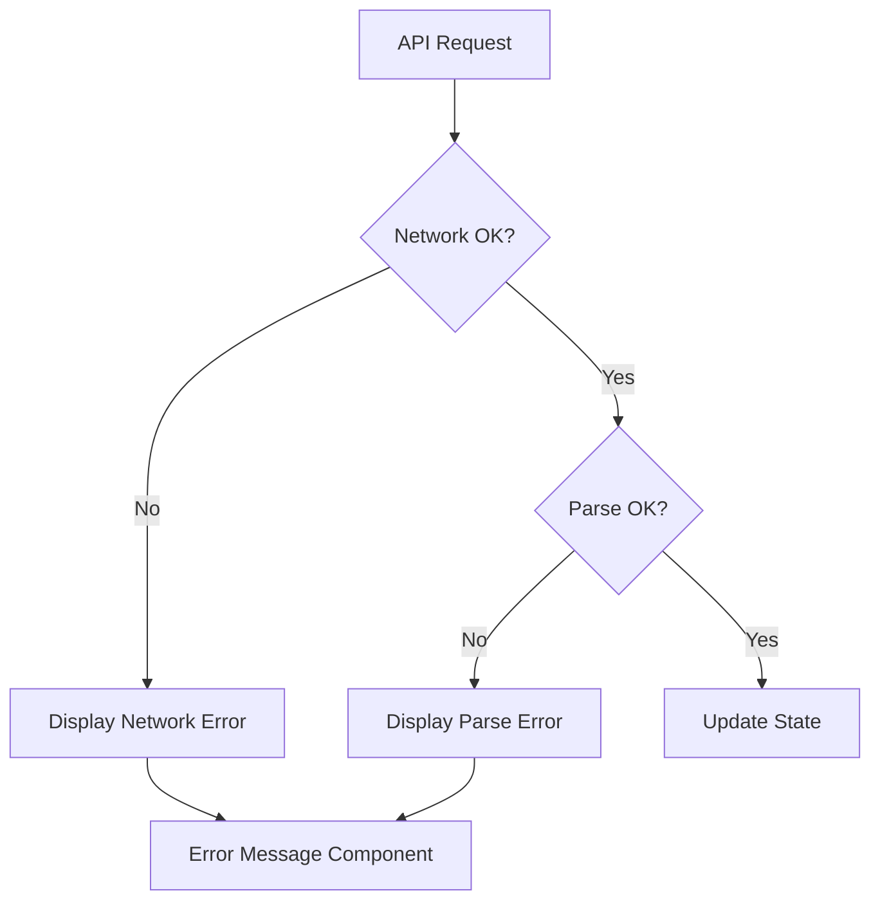
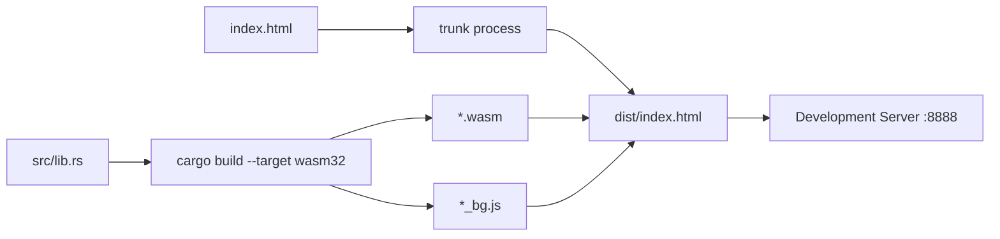
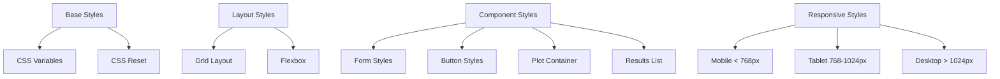
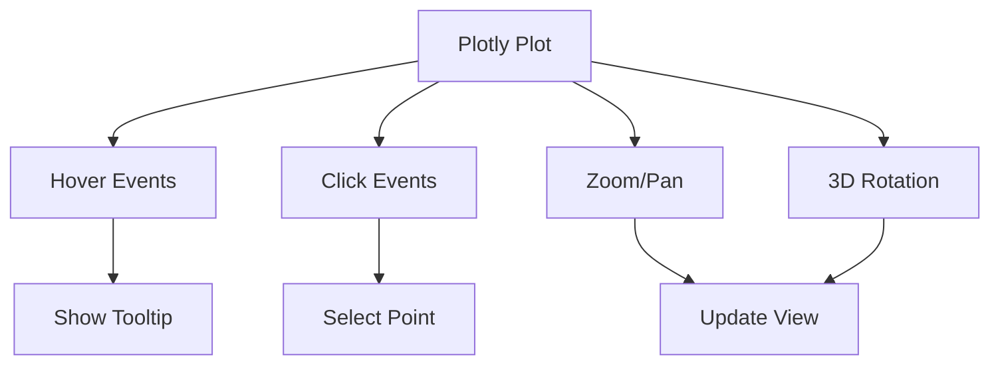

# umap-web

The `umap-web` crate provides the interactive web frontend for the UMAP Text Visualizer, built with Yew (Rust WASM framework) and Plotly.js.

## Overview

**Location:** `crates/umap-web/`

**Purpose:**
- Interactive search interface
- 2D/3D scatter plot visualization
- UMAP parameter controls
- Real-time API integration

**Technology:**
- Yew framework (Rust WASM)
- Plotly.js for visualization (via CDN)
- gloo-net for HTTP requests
- CSS for styling

## Architecture



## Component Structure

### App Component

**Purpose:** Root component managing application state.

**State:**

```rust
pub struct App {
    query: String,
    k: usize,
    dims: usize,
    method: String,
    n_neighbors: usize,
    min_dist: f64,
    n_epochs: usize,
    learning_rate: f64,
    response: Option<SearchResponse>,
    loading: bool,
    error: Option<String>,
}
```

**Component Tree:**



### Message Flow



## Key Features

### Search Interface

**Components:**



**Implementation:**

```rust
html! {
    <div class="search-form">
        <input
            type="text"
            placeholder="Enter search query..."
            value={self.query.clone()}
            oninput={ctx.link().callback(|e: InputEvent| {
                Msg::UpdateQuery(e.target().value())
            })}
        />
        <button
            onclick={ctx.link().callback(|_| Msg::Search)}
            disabled={self.loading}
        >
            {"Search"}
        </button>
    </div>
}
```

### 2D/3D Visualization

**Toggle Control:**

```rust
html! {
    <div class="dim-toggle">
        <button
            class={if self.dims == 2 { "active" } else { "" }}
            onclick={ctx.link().callback(|_| Msg::SetDims(2))}
        >
            {"2D"}
        </button>
        <button
            class={if self.dims == 3 { "active" } else { "" }}
            onclick={ctx.link().callback(|_| Msg::SetDims(3))}
        >
            {"3D"}
        </button>
    </div>
}
```

**Plotly Integration:**



**Scatter Plot Configuration:**

```rust
// 2D scatter
let trace = Scatter::new(x_coords, y_coords)
    .mode(Mode::Markers)
    .marker(Marker::new().size(8).color_array(scores))
    .text_array(texts)
    .hover_text_array(hover_texts);

// 3D scatter
let trace = Scatter3D::new(x_coords, y_coords, z_coords)
    .mode(Mode::Markers)
    .marker(Marker::new().size(6).color_array(scores))
    .text_array(texts)
    .hover_text_array(hover_texts);
```

### UMAP Parameter Controls

**Parameters Exposed:**

| Parameter | Control Type | Range | Default |
|-----------|-------------|-------|---------|
| n_neighbors | Number input | 2-100 | 15 |
| min_dist | Number input | 0.0-1.0 | 0.1 |
| spread | Number input | 0.1-3.0 | 1.0 |
| n_epochs | Number input | 50-500 | 200 |
| learning_rate | Number input | 0.1-5.0 | 1.0 |

**UI Layout:**



### Results List

**Display Format:**

```
┌────────────────────────────────────────┐
│ Result #1                Score: 0.9234 │
│ Source: ml-textbook.txt (chunk 42)     │
│ ─────────────────────────────────────  │
│ Neural networks are computing systems  │
│ inspired by biological neural networks │
│ that constitute animal brains...       │
└────────────────────────────────────────┘
```

**Implementation:**

```rust
html! {
    <div class="results-list">
        {for self.response.points.iter().enumerate().map(|(i, point)| {
            html! {
                <div class="result-item">
                    <div class="result-header">
                        <span class="result-number">{format!("#{}", i + 1)}</span>
                        <span class="result-score">{format!("Score: {:.4}", point.score)}</span>
                    </div>
                    <div class="result-meta">
                        {format!("{} (chunk {})", point.source, point.chunk_index)}
                    </div>
                    <div class="result-text">
                        {&point.text}
                    </div>
                </div>
            }
        })}
    </div>
}
```

## API Integration

### HTTP Client

**Using gloo-net:**

```rust
use gloo_net::http::Request;

async fn fetch_search(params: SearchParams) -> Result<SearchResponse> {
    let url = format!(
        "/api/search?query={}&k={}&dims={}&method={}",
        params.query, params.k, params.dims, params.method
    );

    let response = Request::get(&url)
        .send()
        .await?;

    let data = response
        .json::<SearchResponse>()
        .await?;

    Ok(data)
}
```

### Data Types

```rust
#[derive(Debug, Clone, Deserialize)]
pub struct SearchResponse {
    pub query: String,
    pub k: usize,
    pub dims: usize,
    pub method: String,
    pub points: Vec<SearchPoint>,
}

#[derive(Debug, Clone, Deserialize)]
pub struct SearchPoint {
    pub id: i64,
    pub source: String,
    pub chunk_index: usize,
    pub text: String,
    pub score: f32,
    pub x: f32,
    pub y: f32,
    pub z: Option<f32>,
}
```

### Error Handling



**Error Display:**

```rust
html! {
    if let Some(error) = &self.error {
        <div class="error-message">
            <span class="error-icon">{"⚠"}</span>
            <span class="error-text">{error}</span>
        </div>
    }
}
```

## Build Process

### Development Build

```bash
cd crates/umap-web
trunk serve --port 8888
```

**What happens:**



### Production Build

```bash
cd crates/umap-web
trunk build --release --dist dist
```

**Optimizations:**

- `wasm-opt` - Optimize WASM binary
- Minification - Compress JavaScript glue code
- Asset bundling - Inline small assets

**Output:**

```
dist/
├── index.html
├── app-<hash>.js
├── app-<hash>.wasm
└── <assets>
```

### GitHub Pages Build

```bash
cd demo-app
trunk build --release --public-url /umap/
```

**Note:** `--public-url` sets base path for GitHub Pages.

**Output:** `docs/` directory (configured in Trunk.toml)

## Styling

### CSS Architecture



### CSS Variables

```css
:root {
    --primary-color: #3b82f6;
    --secondary-color: #10b981;
    --error-color: #ef4444;
    --bg-color: #ffffff;
    --text-color: #1f2937;
    --border-color: #e5e7eb;
    --shadow: 0 1px 3px rgba(0, 0, 0, 0.1);
}
```

### Responsive Design

```css
/* Mobile first */
.container {
    padding: 1rem;
}

/* Tablet */
@media (min-width: 768px) {
    .container {
        padding: 2rem;
        max-width: 768px;
        margin: 0 auto;
    }
}

/* Desktop */
@media (min-width: 1024px) {
    .container {
        max-width: 1200px;
    }

    .layout {
        display: grid;
        grid-template-columns: 1fr 2fr;
        gap: 2rem;
    }
}
```

## Interactivity

### Plotly Interactions

**Supported Interactions:**



**Configuration:**

```rust
let layout = Layout::new()
    .hover_mode(HoverMode::Closest)
    .show_legend(false)
    .drag_mode(DragMode::Orbit);  // For 3D

let config = Config::new()
    .responsive(true)
    .display_mode_bar(true);
```

### Keyboard Shortcuts

Future enhancement:

| Key | Action |
|-----|--------|
| Enter | Submit search |
| Esc | Clear search |
| 2 | Switch to 2D |
| 3 | Switch to 3D |
| U | UMAP method |
| P | PCA method |

## Performance Optimization

### Code Splitting

Future: Load heavy components lazily.

```rust
// Lazy load Plotly only when needed
if self.response.is_some() {
    html! { <Plot data={self.response} /> }
}
```

### Debouncing

Debounce parameter changes to avoid excessive API calls:

```rust
// Update parameters but don't search immediately
Msg::UpdateNeighbors(n) => {
    self.n_neighbors = n;
    // Debounce timer: wait 500ms before auto-search
}
```

### Caching

Browser caching via HTTP headers:

```
Cache-Control: public, max-age=3600
```

## Testing

### Component Tests

```rust
#[cfg(test)]
mod tests {
    use super::*;
    use yew::prelude::*;

    #[test]
    fn test_search_form_render() {
        let app = App::default();
        // Test component rendering
    }

    #[test]
    fn test_message_handling() {
        // Test state updates
    }
}
```

### Integration Tests

```bash
# Using wasm-pack
wasm-pack test --headless --firefox
wasm-pack test --headless --chrome
```

### Manual Testing Checklist

- [ ] Search with various queries
- [ ] Toggle 2D/3D
- [ ] Change UMAP parameters
- [ ] Hover over points
- [ ] Click points in plot
- [ ] Resize window (responsive)
- [ ] Test on mobile device
- [ ] Test error states (network failure)

## Deployment

### Local Development

```bash
# Terminal 1: Backend
./target/debug/umap-cli serve --db data.db

# Terminal 2: Frontend
cd crates/umap-web
trunk serve --port 8888 --proxy-backend=http://localhost:8080/api
```

### Production (with backend)

```bash
# Build frontend
cd crates/umap-web
trunk build --release --dist dist

# Serve via umap-cli
./target/release/umap-cli serve \
  --db data.db \
  --static-dir crates/umap-web/dist
```

### Static Demo (GitHub Pages)

```bash
# Build demo (no backend, uses JSON files)
cd demo-app
trunk build --release --public-url /umap/

# Output in docs/
# Commit and push to GitHub
git add docs/
git commit -m "Update demo"
git push origin main
```

## Demo vs Production Differences

| Feature | Production | Demo (GitHub Pages) |
|---------|-----------|---------------------|
| Backend | Live API server | No backend |
| Data | Dynamic database | Pre-computed JSON |
| Search | Real-time | Canned results |
| Ingestion | Supported | Not supported |
| Parameters | Tunable | Fixed (pre-computed) |

**Demo Implementation:**

```rust
// Production: API call
async fn fetch_search(query: &str) -> Result<SearchResponse> {
    let url = format!("/api/search?query={}", query);
    Request::get(&url).send().await?.json().await
}

// Demo: Load JSON file
async fn fetch_search(query: &str) -> Result<SearchResponse> {
    let filename = format!("demo-data/{}.json", sanitize(query));
    Request::get(&filename).send().await?.json().await
}
```

## Related Pages

- [[Architecture]] - Overall system design
- [[Data Flow]] - Frontend/backend interactions
- [[umap-cli]] - Backend API used by frontend
- [[Deployment]] - Deployment strategies
- [Source Code](../../tree/main/crates/umap-web) - Browse source
- [Demo App Source](../../tree/main/demo-app) - GitHub Pages demo

## External Resources

- [Yew Documentation](https://yew.rs/) - Rust WASM framework
- [Plotly.js Documentation](https://plotly.com/javascript/) - Visualization library
- [gloo Documentation](https://docs.rs/gloo/) - WASM utilities
- [Trunk Documentation](https://trunkrs.dev/) - WASM build tool
- [WASM Bindgen](https://rustwasm.github.io/wasm-bindgen/) - Rust/JS interop
